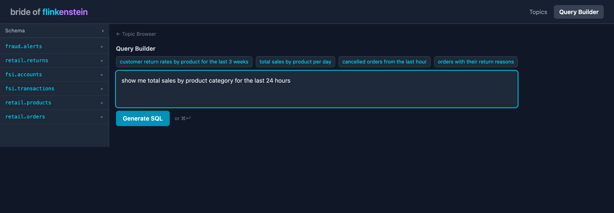
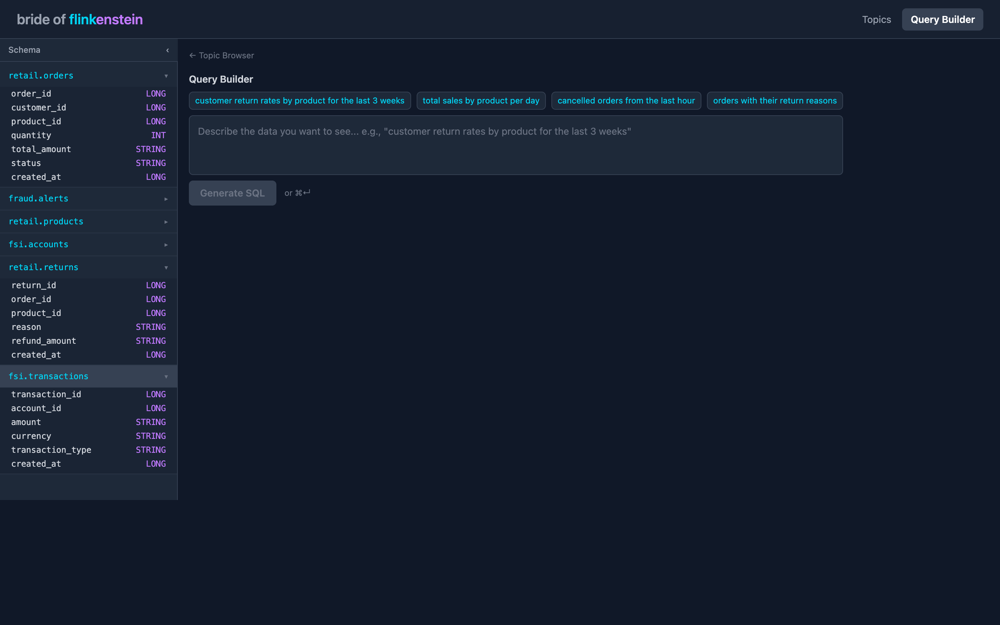
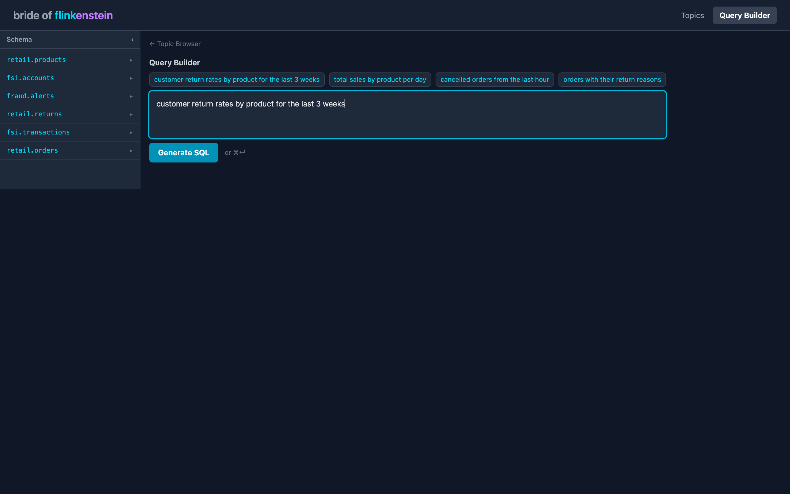

# Bride of Flinkenstein (BoF)

Natural language to live Flink SQL in one click. Describe the data you want to see, BoF generates validated Flink SQL, and pushes it live to a Confluent Platform cluster. The resultant Kafka topic appears alongside your source topics with real streaming messages.



## What It Does

1. **Describe what you want** in plain English — *"customer return rates by product for the last 3 weeks"*
2. **BoF generates Flink SQL** grounded in your actual topic schemas, with syntax validation and a traffic-light indicator
3. **Preview sample output** before committing — see mock rows in table or JSON format
4. **Push Live** — submits the SQL to Flink via SQL Gateway, tracks job state, and streams live messages from the derived output topic
5. **Derived topic appears** in the Schema Sidebar alongside source topics with a `derived` badge

## Screenshots

### Query Builder with Schema Sidebar

The sidebar pulls live schema metadata from Schema Registry and displays every topic with its Avro field types. Click any topic to expand its fields.



### NLP Input with Example Prompts

Clickable example prompts seed the textarea. Type your own query or pick a preset. `Cmd+Enter` to generate.



## Architecture

Confluent Platform containers (`cp-kafka`, `cp-schema-registry`, `cp-flink`) are used rather than Apache OSS images. This preserves SQL dialect parity with Confluent Cloud Flink, making a future CC migration a connection/auth refactor rather than a SQL rewrite.

```
┌─────────────────────────────────────────────────────────────────────┐
│                         Docker Compose Stack                        │
│                                                                     │
│  ┌──────────┐  ┌─────────────────┐  ┌──────────┐  ┌─────────────┐ │
│  │  Kafka    │  │ Schema Registry │  │  Flink   │  │ SQL Gateway │ │
│  │  (KRaft)  │  │    (CP 7.7)     │  │  (2.1)   │  │   (REST)    │ │
│  │  :9092    │  │    :8081        │  │  :8082   │  │   :8083     │ │
│  └──────────┘  └─────────────────┘  └──────────┘  └─────────────┘ │
│       ▲                ▲                                  ▲        │
│       │                │                                  │        │
│  ┌────┴────────────────┴──┐                               │        │
│  │   3 Continuous Producers│                               │        │
│  │  retail / fsi / fraud   │                               │        │
│  └─────────────────────────┘                               │        │
└─────────────────────────────────────────────────────────────┼───────┘
                                                             │
┌────────────────────────────────────────────────────────────┐│
│                    Node.js Backend (:3001)                  ││
│                                                            ││
│  ┌──────────────┐  ┌───────────────┐  ┌──────────────────┐││
│  │ LLM Service  │  │ SQL Validation│  │  Flink Service   │├┘
│  │ (Claude API) │  │ (dt-sql-parser│  │ (SQL Gateway REST││
│  │              │  │  + catalog)   │  │  + job tracking) ││
│  └──────────────┘  └───────────────┘  └──────────────────┘│
│  ┌──────────────┐  ┌───────────────┐                      │
│  │Schema Registry│  │Kafka Consumer │                      │
│  │   Service    │  │  Service      │                      │
│  └──────────────┘  └───────────────┘                      │
└────────────────────────────────────────────────────────────┘
                           │
┌──────────────────────────┴─────────────────────────────────┐
│                React Frontend (:5173)                       │
│                                                             │
│  ┌─────────────┐  ┌─────────┐  ┌─────────────────────────┐│
│  │Schema Sidebar│  │ Monaco  │  │ Deployment Status Panel ││
│  │(live topics) │  │ Editor  │  │ (job state + messages)  ││
│  └─────────────┘  └─────────┘  └─────────────────────────┘│
└─────────────────────────────────────────────────────────────┘
```

## Sample Data Domains

BoF ships with three business domains producing continuous Avro events with cross-topic referential integrity:

| Domain | Topics | Rate | Use Case |
|--------|--------|------|----------|
| **Retail** | `retail.orders`, `retail.returns`, `retail.products` | ~3.5/s | JOINs, return rate analysis, product metrics |
| **FSI** | `fsi.transactions`, `fsi.accounts` | ~1.3/s | Account aggregations, transaction monitoring |
| **Fraud** | `fraud.alerts` | ~0.5/s | Risk scoring, cross-domain fraud detection |

All schemas use Avro with `TopicNameStrategy` subject naming and `BACKWARD` compatibility.

## Tech Stack

| Layer | Technology |
|-------|------------|
| **Frontend** | React 19, Vite 8, Tailwind CSS 4, Monaco Editor |
| **Backend** | Node.js, Express 5 |
| **LLM** | Claude API (claude-sonnet-4-6) with 3-retry self-correction |
| **SQL Validation** | dt-sql-parser (ANTLR4-based Flink SQL parser) + catalog check |
| **Streaming** | Confluent Platform — Kafka (KRaft), Schema Registry, Flink 2.1, SQL Gateway |
| **Data** | KafkaJS, Avro via @kafkajs/confluent-schema-registry |
| **Testing** | Jest 29, Supertest |

## Getting Started

### Prerequisites

- Docker Desktop (or Docker Engine + Compose)
- Node.js 20+
- An [Anthropic API key](https://console.anthropic.com/) for SQL generation

### 1. Start the infrastructure

```bash
cd infrastructure
docker compose up -d
```

This brings up Kafka, Schema Registry, Flink (JobManager + TaskManager + SQL Gateway), and three continuous data producers. Wait for all services to be healthy:

```bash
docker compose ps
```

#### Service Ports

| Service | Host Port | Notes |
|---------|-----------|-------|
| Kafka broker | 9092 | External listener (29092 internal) |
| Schema Registry | 8081 | |
| Flink JobManager UI | 8082 | Remapped from 8081 to avoid SR collision |
| Flink SQL Gateway | 8083 | |
| Backend | 3001 | |
| Frontend (dev) | 5173 | |

#### Flink Image

`infrastructure/Dockerfile.flink` extends `confluentinc/cp-flink:2.1.1-cp1-java21` with a multi-stage build — an Alpine/curl stage downloads the Kafka connector (`flink-sql-connector-kafka-4.0.1-2.0`) and Confluent Avro/Schema Registry JARs into `/opt/flink/lib/`. The base image does not bundle these connectors. Without them, SQL jobs fail with `ClassNotFoundException`.

### 2. Start the backend

```bash
cd backend
npm install
echo "ANTHROPIC_API_KEY=sk-ant-..." > .env
npm start
```

The backend runs on `http://localhost:3001`.

### 3. Start the frontend

```bash
cd frontend
npm install
npm run dev
```

Open `http://localhost:5173` in your browser.

### 4. Generate your first query

Type a natural language query like:

> *customer return rates by product for the last 3 weeks*

Click **Generate SQL**. BoF will:
- Pull all topic schemas from Schema Registry
- Feed them to Claude with Flink SQL dialect rules and few-shot examples
- Validate the generated SQL with dt-sql-parser
- Self-correct up to 3 times if validation fails
- Display the SQL in a Monaco editor with a traffic-light validation indicator
- Show sample output rows

### 5. Push Live

Click **Push Live** to deploy the Flink SQL job. The Deployment Status Panel shows real-time state transitions (Submitting → Running → Streaming) and live messages from the output topic.

## API Endpoints

| Method | Path | Description |
|--------|------|-------------|
| `POST` | `/api/query` | Submit NLP query, returns generated SQL + validation + sample output |
| `POST` | `/api/query/refine` | Conversational follow-up using session context |
| `POST` | `/api/query/validate` | Re-validate manually edited SQL |
| `GET` | `/api/schemas` | List all topics with field types (includes `isDerived` flag) |
| `POST` | `/api/query/deploy` | Deploy Flink SQL job via SQL Gateway |
| `GET` | `/api/jobs/:id` | Poll job status (state, elapsed, output topic) |
| `DELETE` | `/api/jobs/:id` | Stop a running Flink job |
| `GET` | `/api/topics/:topic/messages` | Tail live messages from any Kafka topic |

## Project Structure

```
bride_of_flinkenstein/
├── backend/
│   ├── src/
│   │   ├── services/
│   │   │   ├── llmService.js          # Claude API + self-correction loop
│   │   │   ├── sqlValidationService.js # dt-sql-parser + catalog check
│   │   │   ├── schemaRegistryService.js# Schema Registry REST client
│   │   │   ├── flinkService.js        # SQL Gateway REST + job tracking
│   │   │   ├── kafkaConsumerService.js # Per-request message tailing
│   │   │   └── mockDataService.js     # Sample row generation
│   │   ├── prompts/
│   │   │   ├── systemPrompt.js        # Schema-grounded system prompt
│   │   │   └── fewShotExamples.js     # Flink SQL dialect examples
│   │   └── routes/api.js              # Express routes
│   └── tests/                         # 188 tests (Jest + Supertest)
├── frontend/
│   ├── src/
│   │   ├── components/
│   │   │   ├── QueryBuilder.jsx       # Main NLP → SQL → Push Live component
│   │   │   ├── DeploymentStatusPanel.jsx # Job state + live messages
│   │   │   ├── SqlEditor.jsx          # Monaco editor wrapper
│   │   │   ├── SampleOutput.jsx       # Table/JSON toggle for mock rows
│   │   │   └── ValidationIndicator.jsx # Traffic light (green/yellow/red)
│   │   ├── hooks/
│   │   │   ├── useJobPolling.js       # 5s job status polling
│   │   │   └── useMessagePolling.js   # 2s message polling with offsets
│   │   └── App.jsx
│   └── vite.config.js
└── infrastructure/
    ├── docker-compose.yml             # 8-service Confluent Platform stack
    ├── Dockerfile.flink               # Custom Flink with Kafka/Avro JARs
    ├── schemas/                       # 6 Avro schemas (.avsc)
    └── producers/                     # 3 continuous data producers
```

## Testing

```bash
# Backend — 188 tests
cd backend && npx jest

# Frontend — build check
cd frontend && npx vite build
```

Integration tests that require live infrastructure use env-guarded `describe.skip`:
- `ANTHROPIC_API_KEY` — canonical NLP-to-SQL pipeline test
- `FLINK_GATEWAY_URL` — SQL Gateway submission test

Both skip cleanly in CI without failing.

## How the SQL Generation Works

1. **Schema grounding** — all topic schemas are fetched from Schema Registry and serialized as markdown tables in the system prompt
2. **Flink SQL dialect rules** — 10 rules enforce Confluent Platform conventions (backtick quoting, `TRY_CAST` for STRING fields, `TO_TIMESTAMP_LTZ` for BIGINT timestamps, `value.format = 'avro-confluent'`, `scan.startup.mode = 'earliest-offset'`)
3. **Few-shot examples** — 4 canonical Flink SQL examples demonstrate correct patterns
4. **Self-correction loop** — if the generated SQL fails validation (dt-sql-parser syntax check + catalog field check), errors are fed back to Claude for up to 3 retry attempts
5. **Traffic light** — green (valid), yellow (valid with warnings), red (syntax errors or unknown fields)

### Conversational Follow-Ups

The backend maintains an in-memory `sessions` Map (1-hour TTL) keyed by `sessionId`. Follow-up requests (e.g., *"make it weekly instead of daily"*) append to the Claude message history, preserving query intent across refinements. The `sessionId` is generated client-side and sent with `POST /api/query/refine`.

### Derived Topic Detection

`GET /api/schemas` returns an `isDerived` flag per topic. A topic is considered derived if its name starts with `derived.`. The LLM is instructed to name all output topics `derived.{semantic_name}`. Schema Registry registration happens automatically when Flink begins writing — no manual pre-registration needed.

## Flink Runtime Notes

**Streaming INSERT stays RUNNING permanently.** A Flink SQL `INSERT INTO` submitted via SQL Gateway transitions to `RUNNING` and stays there for streaming jobs. The backend treats `RUNNING` as deployment success — do not poll for `FINISHED`.

**BIGINT timestamps require explicit conversion.** `created_at` fields are epoch milliseconds (BIGINT). The system prompt instructs Claude to emit `TO_TIMESTAMP_LTZ(created_at, 3)` with a `WATERMARK FOR event_time AS event_time - INTERVAL '5' SECOND` clause.

**STRING monetary fields require casting.** `total_amount` is Avro type `string`. Arithmetic operations require `TRY_CAST(total_amount AS DECIMAL(10,2))`. The catalog check flags uncast uses as a warning (yellow traffic light).

## Known Limitations

- **Topic Browser** — the Topics tab is a placeholder. Source topic browsing is not yet implemented. The Schema Sidebar in the Query Builder tab provides schema inspection in the interim.
- **In-memory job state** — the `flink_jobs` Map is not persisted. If the backend restarts, tracked job state is lost. Running Flink jobs continue independently and the derived topic data is preserved, but the Deployment Status panel won't show them.

## License

MIT
